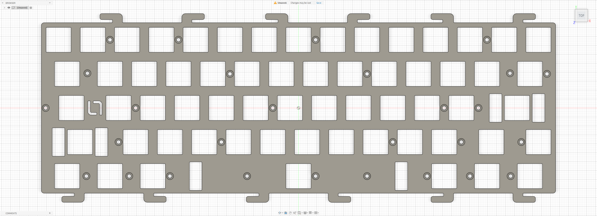

# KBDFans D60 Lite

Custom EC plate file for the **KBDFans D60 Lite**, designed for use with the **EC60X SE PCB**.

## Preview

### Naevies EC Plate

## Variants

### Naevies EC Plate

- File: [`d60-lite-naevies.step`](./d60-lite-naevies.step)
- Switch type: EC
- Configuration: Naevies EC
- PCB: EC60X SE

## Notes

Plate file by **La-Versa.works**.

This plate is designed for **Naevies EC switches** and for use with the **EC60X SE PCB**.

Please verify dimensions, tolerances, material thickness, and compatibility before manufacturing.

## License

[CC BY-NC-SA 4.0](../../../LICENSE.md) — commercial use requires permission from **La-Versa.works**.
