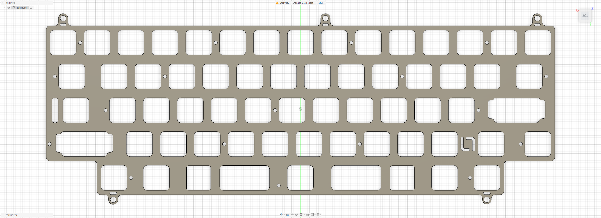
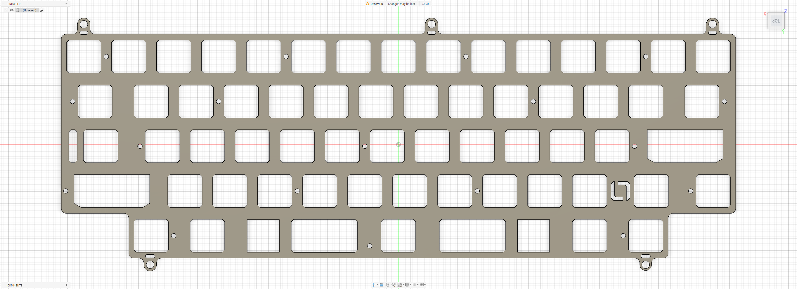

# Matrix Falcon

Custom EC plate files for the **Matrix Falcon**, designed for use with the **YDKB EE60 PCB**.

## Preview

### Dynacap Plate

### OEM EC Plate

## Variants

### Dynacap Plate

- File: [`falcon-dynacap.dxf`](./falcon-dynacap.dxf)
- Switch type: EC
- Configuration: Dynacap
- PCB: YDKB EE60

### OEM EC Plate

- File: [`falcon-ec.dxf`](./falcon-ec.dxf)
- Switch type: EC
- Configuration: OEM/Des etc.
- PCB: YDKB EE60

## Notes

Plate files by **La-Versa.works**.

Both plate variants are designed for use with the **YDKB EE60 PCB**.

The **Dynacap Plate** is designed for Dynacap switches and uses modified switch and stabilizer cutout geometry originally based on work by **Cipulot**.

The **OEM EC Plate** is designed for standard OEM EC switch housings, such as **Deskeys** and other Topre-compatible EC switches.

Please verify dimensions, tolerances, material thickness, and compatibility before manufacturing.

## Credits

For the **Dynacap Plate**, the switch and stabilizer cutout geometry was initially based on work by **Cipulot** and was subsequently modified by **La-Versa.works**.

Original source:  
[Cipulot EC Plate Maker](https://ec-plate-maker.lusvsolutions.com/)

Cipulot's original work is licensed under
[CC BY-NC-SA 4.0](https://creativecommons.org/licenses/by-nc-sa/4.0/).

## License

[CC BY-NC-SA 4.0](../../../LICENSE.md) — commercial use requires permission from **La-Versa.works**.
