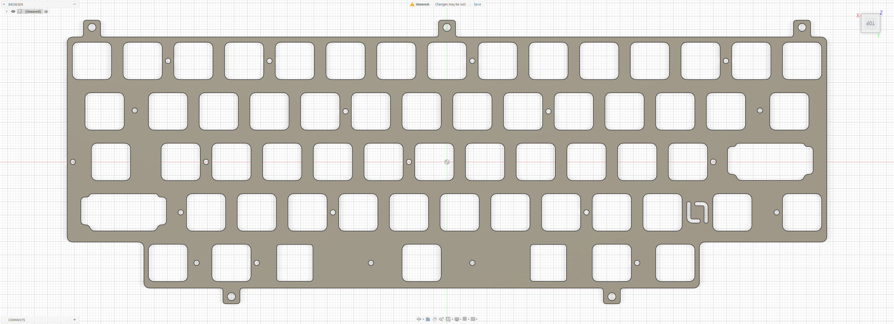

# Matrix Hiya

Custom EC plate file for the **Matrix Hiya**, designed for use with the **EC60X SE PCB**.

## Preview

### Dynacap Plate

## Variants

### Dynacap Plate

- File: [`hiya-dynacap.dxf`](./hiya-dynacap.dxf)
- Switch type: EC
- Configuration: Dynacap
- PCB: EC60X SE

## Notes

Plate file by **La-Versa.works**.

This plate is designed for use with the **EC60X SE PCB**.

The **Dynacap Plate** is designed for Dynacap switches and uses modified switch and stabilizer cutout geometry originally based on work by **Cipulot**.

Please verify dimensions, tolerances, material thickness, and compatibility before manufacturing.

## Credits

The switch and stabilizer cutout geometry was initially based on work by **Cipulot** and was subsequently modified by **La-Versa.works**.

Original source:  
[Cipulot EC Plate Maker](https://ec-plate-maker.lusvsolutions.com/)

Cipulot's original work is licensed under
[CC BY-NC-SA 4.0](https://creativecommons.org/licenses/by-nc-sa/4.0/).

## License

[CC BY-NC-SA 4.0](../../../LICENSE.md) — commercial use requires permission from **La-Versa.works**.
