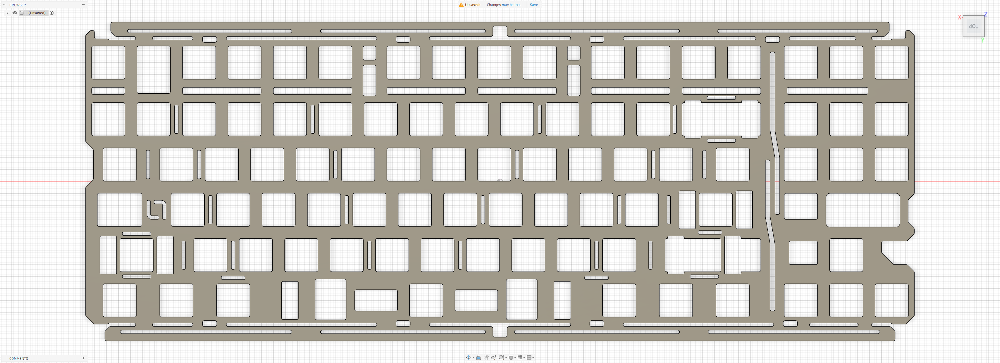

# Geonworks F2-84

Custom MX plate file for the **Geonworks F2-84**.

## Preview

### Standard Plate

## Variants

### Standard Plate

- File: [`f2-84.dxf`](./f2-84.dxf)
- Switch type: MX
- Plate thickness: 1.2 mm

## Notes

Plate file by **La-Versa.works**.

This plate is designed for a **1.2 mm plate thickness**.

Please verify dimensions, tolerances, material thickness, and compatibility before manufacturing.

## License

[CC BY-NC-SA 4.0](../../../LICENSE.md) — commercial use requires permission from **La-Versa.works**.
