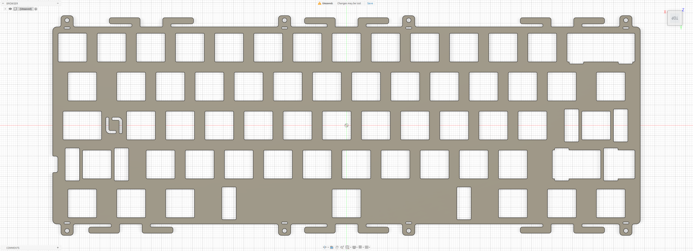

# INKC Studio Rule60 V3

Custom MX plate file for the **INKC Studio Rule60 V3**.

## Preview

### Top / Isolation Mount Plate

## Variants

### Top / Isolation Mount Plate

- File: [`rule60-v3-top-isolation.dxf`](./rule60-v3-top-isolation.dxf)
- Switch type: MX
- Mounting: Top mount / Isolation mount

## Notes

Plate file by **La-Versa.works**.

This plate is designed for the **INKC Studio Rule60 V3** and supports both **top mount** and **isolation mount** configurations.

Please verify dimensions, tolerances, material thickness, and compatibility before manufacturing.

## License

[CC BY-NC-SA 4.0](../../../LICENSE.md) — commercial use requires permission from **La-Versa.works**.
