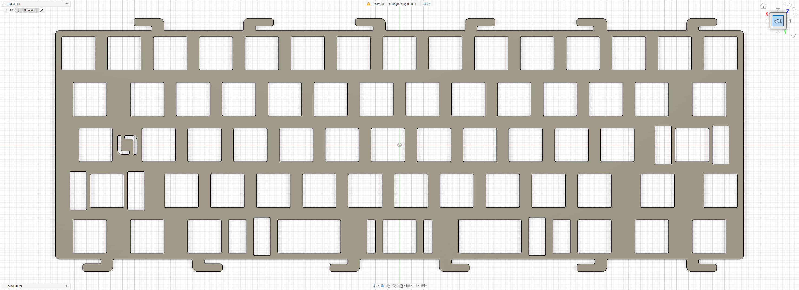

# KBDFans D60 Lite

Custom MX plate file for the **KBDFans D60 Lite**.

## Preview

### Standard Plate

## Variants

### Standard Plate

- File: [`d60-lite.dxf`](./d60-lite.dxf)
- Switch type: MX

## Notes

Plate file by **La-Versa.works**.

The plate tabs were reduced to limit movement around the PCB's USB-C connector and help keep the connector more securely positioned.

The tabs were also split into separate sections.

Please verify dimensions, tolerances, material thickness, and compatibility before manufacturing.

## License

[CC BY-NC-SA 4.0](../../../LICENSE.md) — commercial use requires permission from **La-Versa.works**.
