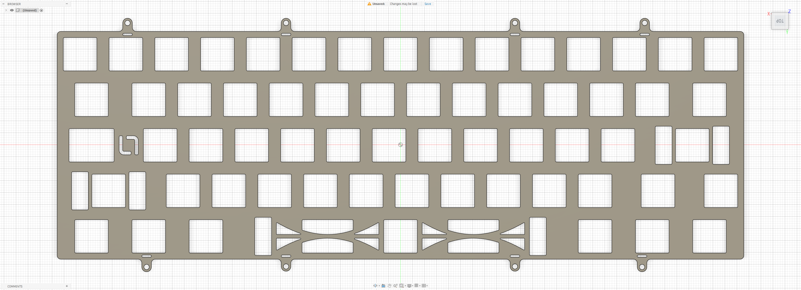

# KBDFans Tofu60 2.0

Custom MX plate file for the **KBDFans Tofu60 2.0**.

## Preview

### Top / Bowl Mount Plate

## Variants

### Top / Bowl Mount Plate

- File: [`tofu60-2.0-top.dxf`](./tofu60-2.0-top.dxf)
- Switch type: MX
- Mounting: Top mount / Bowl mount

## Notes

Plate file by **La-Versa.works**.

This plate is designed for the **KBDFans Tofu60 2.0** and supports both **top mount** and **bowl mount** configurations.

Please verify dimensions, tolerances, material thickness, and compatibility before manufacturing.

## License

[CC BY-NC-SA 4.0](../../../LICENSE.md) — commercial use requires permission from **La-Versa.works**.
