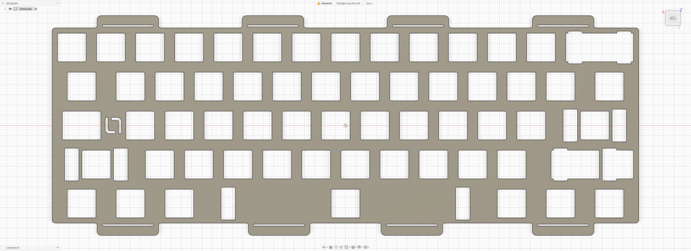
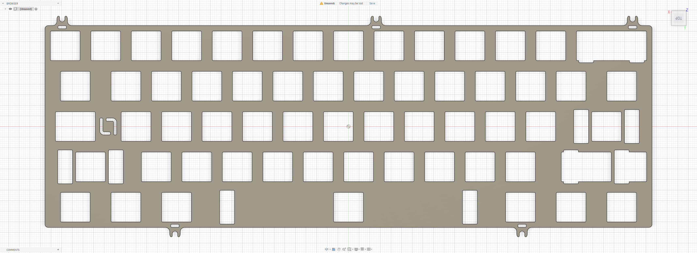

# La-Versa.works Otsukimi

Custom MX plate files for the **La-Versa.works Otsukimi**.

## Preview

### Isolation Mount Plate

### Tadpole / Top Mount Plate

## Variants

### Isolation Mount Plate

- File: [`otsukimi-isolation.dxf`](./otsukimi-isolation.dxf)
- Switch type: MX
- Mounting: Isolation mount

### Tadpole / Top Mount Plate

- File: [`otsukimi-tadpole-top.dxf`](./otsukimi-tadpole-top.dxf)
- Switch type: MX
- Mounting: Tadpole mount / Top mount

## Notes

Plate files by **La-Versa.works**.

The **Isolation Mount Plate** is designed specifically for the isolation mounting configuration.

The **Tadpole / Top Mount Plate** supports both tadpole and top mount configurations.

Please verify dimensions, tolerances, material thickness, and compatibility before manufacturing.

## License

[CC BY-NC-SA 4.0](../../../LICENSE.md) — commercial use requires permission from **La-Versa.works**.
