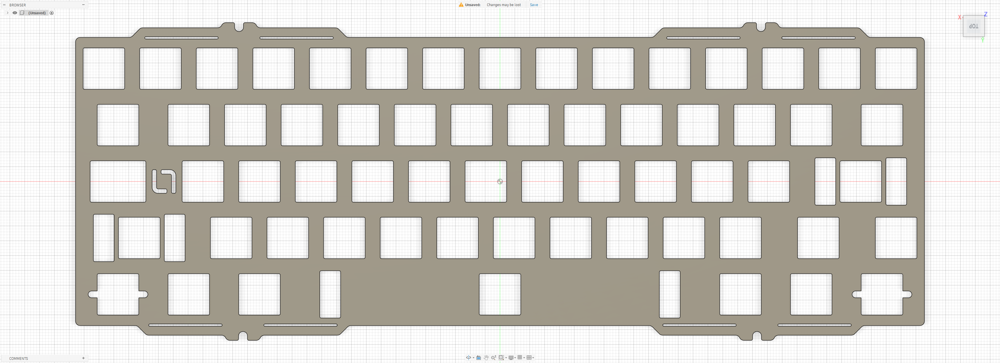

# Luminkey LX60

Custom MX plate files for the **Luminkey LX60**.

## Preview

### Soft Plate

### Stiff Plate

## Variants

### Soft Plate

- File: [`lx60-soft.dxf`](./lx60-soft.dxf)
- Switch type: MX
- Configuration: Soft plate

### Stiff Plate

- File: [`lx60-stiff.dxf`](./lx60-stiff.dxf)
- Switch type: MX
- Configuration: Stiff plate

## Notes

Plate files by **La-Versa.works**.

Two plate variants are provided with different stiffness characteristics: **Soft** and **Stiff**.

Please verify dimensions, tolerances, material thickness, and compatibility before manufacturing.

## License

[CC BY-NC-SA 4.0](../../../LICENSE.md) — commercial use requires permission from **La-Versa.works**.
