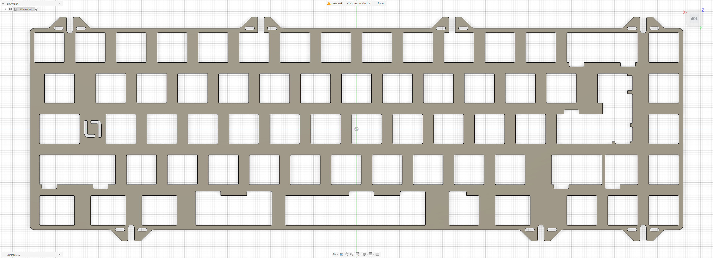

# TGR 910 v2 ME

Custom MX plate file for the **TGR 910 v2 ME**.

## Preview

### Standard Plate

## Variants

### Standard Plate

- File: [`910-v2-me.dxf`](./910-v2-me.dxf)
- Switch type: MX

## Notes

Plate file by **La-Versa.works**.

Please verify dimensions, tolerances, material thickness, and compatibility before manufacturing.

## License

[CC BY-NC-SA 4.0](../../../LICENSE.md) — commercial use requires permission from **La-Versa.works**.
