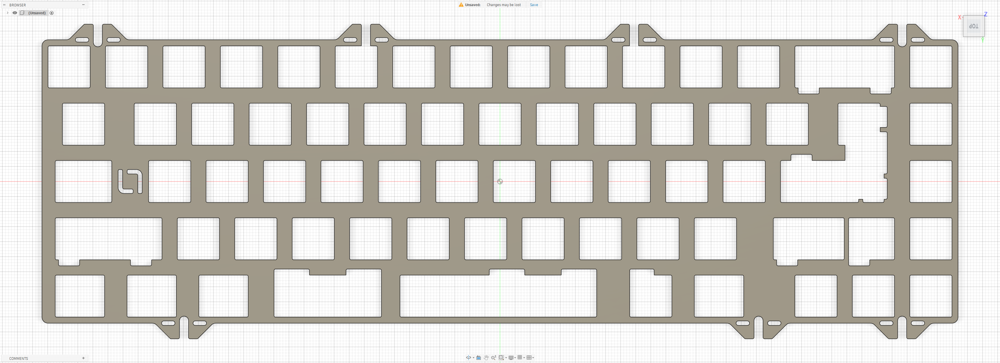

# TGR 910 V3 — GAF / GSK / MIA

Custom MX plate file for the **TGR 910 V3**, compatible with the **GAF, GSK, and MIA** variants.

## Preview

### Standard Plate

## Variants

### Standard Plate

- File: [`910-v3-gaf-gsk-mia.dxf`](./910-v3-gaf-gsk-mia.dxf)
- Switch type: MX
- Compatibility: TGR 910 V3 GAF / GSK / MIA

## Notes

Plate file by **La-Versa.works**.

This plate is intended for the **TGR 910 V3** platform and is compatible with the **GAF, GSK, and MIA** variants.

Please verify dimensions, tolerances, material thickness, and compatibility before manufacturing.

## License

[CC BY-NC-SA 4.0](../../../LICENSE.md) — commercial use requires permission from **La-Versa.works**.
