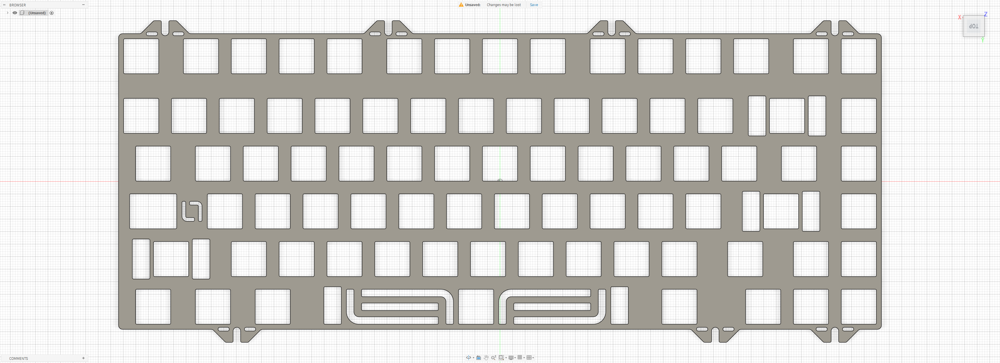
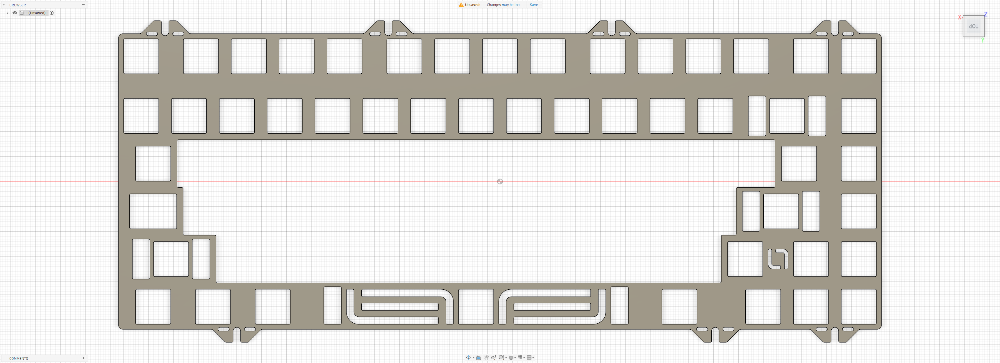

# TGR × MONOKEI Tomo

Custom MX plate files for the **TGR × MONOKEI Tomo**.

## Preview

### Standard Plate

### Half Plate

## Variants

### Standard Plate

- File: [`tomo.dxf`](./tomo.dxf)
- Switch type: MX

### Half Plate

- File: [`tomo-half.dxf`](./tomo-half.dxf)
- Switch type: MX
- Half-plate configuration

## Notes

Plate files by **La-Versa.works**.

Please verify dimensions, tolerances, material thickness, and compatibility before manufacturing.

## License

[CC BY-NC-SA 4.0](../../../LICENSE.md) — commercial use requires permission from **La-Versa.works**.
